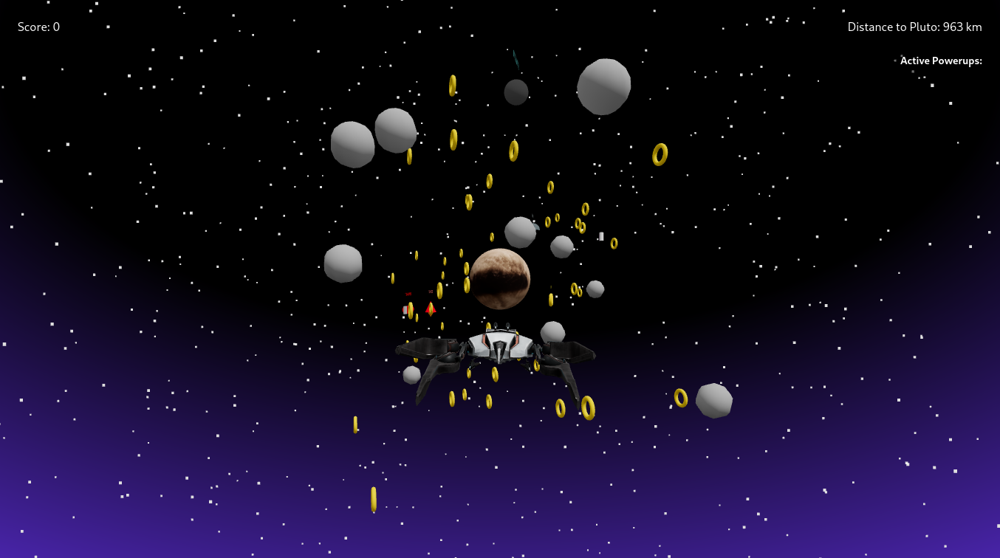
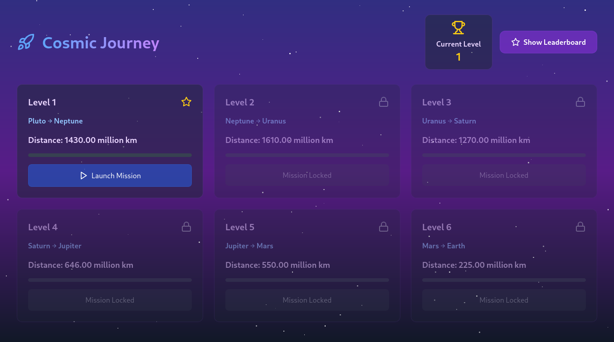

# Space Adventure Game


A thrilling 3D space adventure game where players navigate through our solar system, collecting power-ups, avoiding asteroids, and completing challenging levels.

## 🚀 Features

- **Immersive 3D Solar System** - Explore detailed 3D models of Earth, Mars, Jupiter, Saturn, Uranus, Neptune, and Pluto
- **Multiple Game Levels** - Progress through 7 increasingly challenging levels
- **Custom Spaceship** - Control a responsive 3D spaceship with realistic physics
- **Collectibles** - Gather coins and power-ups to upgrade your ship
- **Leaderboard** - Compete with other players for the highest score
- **In-game Store** - Purchase upgrades and customizations for your ship
- **User Authentication** - Create an account to save your progress and compete on the leaderboard



## 🛠️ Tech Stack

### Frontend
- React 18
- Three.js (with React Three Fiber & Drei)
- GSAP for animations
- React Router for navigation
- Tailwind CSS for styling
- Vite as the build tool

### Backend
- Bun as the runtime environment
- Express.js for API routing
- PocketBase for database and authentication
- JWT for secure tokens
- Multer for file uploads

## 📋 Prerequisites

- Node.js (v18 or higher)
- Bun (latest version)
- PocketBase (latest version)

## 🚀 Installation

### Clone the repository
```bash
git clone https://github.com/yourusername/space-adventure-game.git
cd space-adventure-game
```

### Setup Backend
```bash
cd backend
bun install
```

### Create a PocketBase database
```bash
bun run db:serve
```

### Setup Frontend
```bash
cd ../frontend
npm install
```

## 🎮 Running the Game

### Start the Backend Server
```bash
cd backend
bun run dev
```

### Start the Frontend Development Server
```bash
cd frontend
npm run dev
```

Open your browser and navigate to `http://localhost:5173`


## 🎯 Game Controls

- **W/A/S/D** - Move the spaceship
- **Space** - Boost
- **E** - Collect items
- **ESC** - Pause game

## 📊 Game Progression

1. **Level 1** - Earth Orbit: Learn basic controls
2. **Level 2** - Mars: Navigate through asteroid fields
3. **Level 3** - Jupiter: Manage gravitational pull
4. **Level 4** - Saturn: Navigate through rings
5. **Level 5** - Uranus: Deal with changing gravity directions
6. **Level 6** - Neptune: Face strong solar winds
7. **Level 7** - Pluto: Final challenge with all previous obstacles combined



## 🛍️ In-game Store

Spend your collected coins on:
- Ship upgrades
- Visual customizations
- Special abilities
- Fuel efficiency

## 📱 API Endpoints

| Endpoint | Method | Description |
|----------|--------|-------------|
| `/api/auth/signup` | POST | Register a new user |
| `/api/auth/login` | POST | Login existing user |
| `/api/run/start` | POST | Start a new game run |
| `/api/run/end` | POST | End a game run and save score |
| `/api/leaderboard` | GET | Get top scores |
| `/api/store/items` | GET | Get available store items |
| `/api/store/purchase` | POST | Purchase an item |

## 🧪 Development

### Backend Structure
- `index.ts` - Main entry point
- `routes/` - API endpoints
- `middleware/` - Auth middleware
- `pocketbase/` - Database configuration

### Frontend Structure
- `src/components/` - UI components
- `src/components/levels/` - Game levels
- `src/3d/` - 3D models and loaders
- `src/hooks/` - Custom React hooks

## 🤝 Contributing

1. Fork the repository
2. Create your feature branch (`git checkout -b feature/amazing-feature`)
3. Commit your changes (`git commit -m 'Add some amazing feature'`)
4. Push to the branch (`git push origin feature/amazing-feature`)
5. Open a Pull Request

## 📜 License

This project is licensed under the MIT License - see the LICENSE file for details.

## 🙏 Acknowledgements

- 3D Models from [Sketchfab](https://sketchfab.com)
- Sound effects from [Freesound](https://freesound.org)
- Special thanks to the Three.js and React Three Fiber communities
